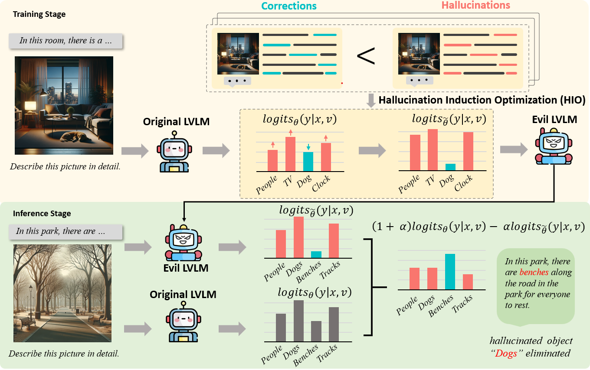

<div align="center">
</div>

# Alleviating Hallucinations in Large Vision-Language Models through Hallucination-Induced Optimization (HIO)

<a href='https://github.com/BT-C/HIO'></a>
<a href='https://github.com/BT-C/HIO'></a>
<a href='https://arxiv.org/pdf/2405.15356'></a>


This is the official repository of the following paper and a project that study positional perception in LVLMs.
> **[Alleviating Hallucinations in Large Vision-Language Models through Hallucination-Induced Optimization](https://arxiv.org/pdf/2405.15356)**<br>
> NeurIPS 2024<br>
> Beitao Chen, Xinyu Lyu†, Lianli Gao†, Jingkuan Song, Heng Tao Shen<br>


# Introduction
We conducted the theoretical analysis to promote the effectiveness of contrast decoding. Building on this insight, we introduce a novel optimization strategy named Hallucination-Induced Optimization (HIO). This strategy seeks to amplify the contrast between hallucinatory and targeted tokens relying on a fine-tuned theoretical preference model (i.e., Contrary Bradley-Terry Model), thereby facilitating efficient contrast decoding to alleviate hallucinations in LVLMs. Extensive experimental research demonstrates that our HIO strategy can effectively reduce hallucinations in LVLMs, outperforming state-of-the-art methods across various benchmarks.

Visit our 🏠 [project page](https://github.com/BT-C/HIO) and 📃 [paper](https://arxiv.org/pdf/2405.15356) to explore more!




## 🎈News

#### 📌 Pinned

* [2024.09.29] 📃 Our HIO is accepted by [NeurIPS 2024](https://neurips.cc/virtual/2024/poster/95118)!
* [2024.5.30] 📃 Our paper is accesible at [arxiv](https://arxiv.org/pdf/2405.15356) now. 


## Install
1. Clone this repository and navigate to HIO folder
``` 
git clone https://github.com/BT-C/HIO.git
cd HIO
```
2. Install Requirements
```
conda create -n hio python=3.10 -y
conda activate hio
pip install --upgrade pip
pip install -e .
```


## Licenses


[](https://github.com/tatsu-lab/stanford_alpaca/blob/main/LICENSE)
[](https://github.com/tatsu-lab/stanford_alpaca/blob/main/DATA_LICENSE)

**Usage and License Notices**: The data, code, and checkpoint are intended and licensed for research use only. They are also restricted to uses that follow the license agreement of LLaMA, Vicuna, and Chat GPT. The dataset is CC BY NC 4.0 (allowing only non-commercial use) and models trained using the dataset should not be used outside of research purposes.


## Acknowledgement
   - [LLaVA-1.5](https://github.com/haotian-liu/LLaVA). The LLaVA-v1.5 part of HIO is based on the official LLaVA-1.5 implementation, which is a great open-source work on LVLM.
   - [MiniGPT-4](https://github.com/Vision-CAIR/MiniGPT-4). The MiniGPT-4 part of HIO is based on the official MiniGPT-4 implementation. 

## Paper and Citing HIO

You can find more details in our [paper](https://arxiv.org/pdf/2405.15356).

If you're using HIO in your research or applications, please cite using this BibTeX:

```bibtex
@article{chen2024alleviating,
  title={Alleviating Hallucinations in Large Vision-Language Models through Hallucination-Induced Optimization},
  author={Chen, Beitao and Lyu, Xinyu and Gao, Lianli and Song, Jingkuan and Shen, Heng Tao},
  journal={arXiv preprint arXiv:2405.15356},
  year={2024}
}
```
